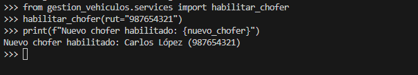

# Sistema de Gestión de Vehículos Utilitarios de Reparto

## Descripción del Proyecto

Este proyecto consiste en el modelamiento de un sistema básico para gestionar los datos de una empresa que opera vehículos utilitarios de reparto. El sistema permite relacionar modelos y crear operaciones que soportan la gestión y manipulación de datos almacenados en una base de datos. A través de este proyecto se busca realizar un análisis similar al de un sistema comercial.

---

## Funcionalidades Principales

El sistema incluye los siguientes servicios:

- **Crear Vehículo**
- **Crear Chofer**
- **Crear Registro Contable**
- **Deshabilitar/Habilitar Chofer**
- **Deshabilitar/Habilitar Vehículo**
- **Obtener Información de Vehículo**
- **Obtener Información de Chofer**
- **Asignar Chofer a Vehículo**
- **Imprimir Datos de Vehículos Activos**

---

## Estructura del Proyecto

### Modelos

#### Vehículo

- **Patente:** Identificador único del vehículo.
- **Marca, Modelo, Año:** Características descriptivas.
- **Activo:** Indicador de si el vehículo está en operación.

#### Chofer

- **RUT:** Identificador único del chofer
- **Nombre, Apellido:** Información personal.
- **Activo:** Indicador de disponibilidad del chofer.
- **Vehículo:** Relación 1 a 1 con un vehículo.

#### Registro Contable

- **Fecha de Compra, Valor:** Información del registro.
- **Vehículo:** Relación 1 a 1 con un vehículo.

### Diagrama de Modelos


---

## Servicios Implementados

Los servicios se encuentran en el archivo `services.py` y están diseñados para interactuar con los modelos definidos.

### Ejemplo de Uso: Crear un Vehículo

```python
from gestion_vehiculos.services import crear_vehiculo

vehiculo = crear_vehiculo(patente="ABC123", marca="Toyota", modelo="Hilux", year=2020)
print(vehiculo)
```

### Ejemplo de Uso: Asignar un Chofer a un Vehículo

```python
from gestion_vehiculos.services import asignar_chofer_a_vehiculo

asignar_chofer_a_vehiculo(rut="12345678K", patente="ABC123")
```

---

## Ejecución y Resultados

### Crear Vehículo


### Crear Chofer


### Asigna un chofer a un vehículo


### Crear Registro Contable


### Deshabilitar Chofer


### Deshabilita un vehículo dado su patente


### Habilita un chofer dado su RUT

## 

### Habilita un vehículo dado su patente

## 

### Obtén un vehículo por su patente

## 

### Obtén un chofer por su RUT

## 

### Imprime los vehículos activos

## 

## Instalación

### Requisitos Previos

- Python 3.9 o superior.
- Django 4.2 o superior.

### Instrucciones

1. Clonar el repositorio:

   ```bash
   git clone https://github.com/tuusuario/tu-repositorio.git
   ```

2. Crear un entorno virtual e instalar las dependencias:

   ```bash
   python -m venv env
   source env/bin/activate  # macOS/Linux
   env\Scripts\activate   # Windows
   pip install -r requirements.txt
   ```

3. Aplicar las migraciones:

   ```bash
   python manage.py migrate
   ```

4. Iniciar el servidor:

   ```bash
   python manage.py runserver
   ```

---

## Autor

Creado por **[Grupo 3]**.

---

## Licencia

Este proyecto está bajo la licencia [MIT](LICENSE).
